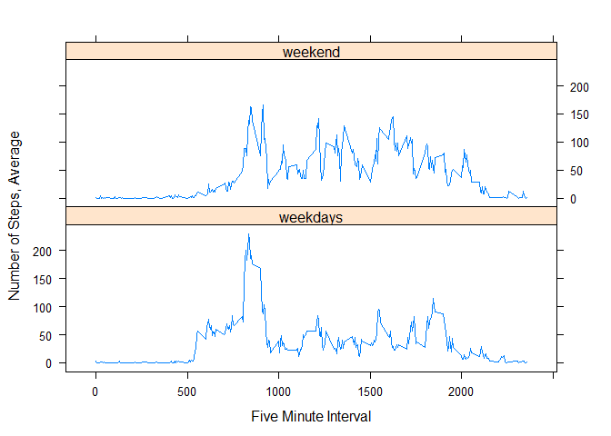

# Reproducible Research, Peer - Graded Assignment: Course Project 1
**author: "John Mastapeter"**
*date: "7/16/2020*"

## Set knitr code chuck global options and load additional libraries


```r
knitr::opts_chunk$set(echo = TRUE)
library(lattice)
```

## Loading and Preprocessing of Data

Set working directory, verify data exists in directory, and review data to make certain data contains necessary columns; *steps, date, and interval*


```r
#Set working directory
setwd("C:/Users/mastapeterj/Documents/Coursera_DataScience/RMarkdownAssignment1")
#Check to see if csv exists in direcory
file.exists("activity.csv")
```

```
## [1] TRUE
```

```r
#Read and review csv
data <- read.csv("activity.csv", header = TRUE)
data_ex <- head(data)
data_ex
```

```
##   steps      date interval
## 1    NA 10/1/2012        0
## 2    NA 10/1/2012        5
## 3    NA 10/1/2012       10
## 4    NA 10/1/2012       15
## 5    NA 10/1/2012       20
## 6    NA 10/1/2012       25
```

```r
#Remove NAs from csv
data_v1 <- na.omit(data)
```

## Detmine what is the mean total of steps recorded each day

Set code to aggregate the total steps record each day


```r
steps_total <- aggregate(steps ~ date, data_v1, FUN = sum)
```

### Visualize histogram of the total steps recored each day


```r
hist(steps_total$steps, main = "Total Steps per Date", xlab = "Number of Steps")
```

<!-- -->

## Calculate and report the mean and median total number of steps recorded each day


```r
#Calculate Mean and Median number of steps recorded each day
steps_mean <- mean(steps_total$steps)
steps_median <- median(steps_total$steps)

#Report the Mean and Median number of steps recored each day
steps_mean
```

```
## [1] 10766.19
```

```r
steps_median
```

```
## [1] 10765
```

## Investigate the average daily activity pattern

Visualize a plot of the five - minute interval and the average number of steps taken, on average, across all the recorded days


```r
#Calcullate mean steps by interval
steps_int_mean <- aggregate(steps ~ interval, data_v1, mean)

#Plot the five minute interval and the average steps across the days
plot(
    steps_int_mean,
    type = "l",
    main = "Average Pattern of Activity by Day",
    xlab = "Five - MInute Interval",
    ylab = "Average Number of Steps"
)
```

<!-- -->

## Determine which five - minute interval, averaged across all the days recored inn the dataset, contain the max number of steps


```r
#Calculate five - minute interval across all days containing the max number of steps
max_steps_5int <- steps_int_mean[which.max(steps_int_mean$steps), ]
max_interval <- max_steps_5int[1, 1]
max_interval
```

```
## [1] 835
```

## Determing the number of NA values in the data


```r
#Calculate and call the total number of NA values in the data
total_NA_vals <- data[is.na(data$steps),]
missing_vals <- nrow(total_NA_vals)
missing_vals
```

```
## [1] 2304
```

## Develop a methodology to fill in the NA values in the data and generate new dataset, which equals the original data but with the missing data accounted for


```r
#Generate dataset that replaces the missing data with new values
data_v2 <- transform(data,
                     steps = ifelse(is.na(data$steps),
                                    steps_int_mean$steps[match(data$interval,
                                                               steps_int_mean$interval)],
                                    data$steps))

#Calculate total steps by interval with new values
data_v2_stepsbyint <- aggregate(steps ~ date, data_v2, FUN = sum)
```

### Visualize histogram of the new data with the NA values filled in


```r
hist(data_v2_stepsbyint$steps, main = "Imputed Number of Steps per Day", xlab = "Number of Steps")
```

<!-- -->

## Calculate and report the new mean and median for the new dataset and determine if there is an impact on the results


```r
#Calculate Mean and Median number of steps taken per day with new values
steps_v2_mean <- mean(data_v2_stepsbyint$steps, na.rm = TRUE)
steps_v2_median <- median(data_v2_stepsbyint$steps, na.rm = TRUE)

#Report the Mean and Median number of steps recored each day
steps_v2_mean
```

```
## [1] 10766.19
```

```r
steps_v2_median
```

```
## [1] 10766.19
```

```r
#Calculate difference between new mean and medianwithout NA and old mean and median
diff_mean <- steps_v2_mean - steps_mean
diff_median <- steps_v2_median - steps_median

#Report the difference between the mean and median between the datasets
diff_mean
```

```
## [1] 0
```

```r
diff_median
```

```
## [1] 1.188679
```

```r
#Calculate difference between new sum without NA and old sum
diff_total = sum(data_v2_stepsbyint$steps) - sum(steps_total$steps)
diff_total
```

```
## [1] 86129.51
```

After reviewing the mean and median numbers from the original and edited dataset, their is limited different in the results, wih the difference in the median number coming out to 1.188679.

However there is a significant increase in total steps, 8,6129 steps in the new dataset.

## Determine the different activity patterns between weekdays and weekends

Develop a new variable in the table the records if a particular date is a weekday or weekend based off the given date.


```r
#Function to assign weekdays or weekend values to date
Day_Type <- function(date) {
    day <- weekdays(date)
    if (day %in% c('Monday', 'Tuesday', 'Wednesday', 'Thursday', 'Friday'))
        return ("weekdays")
    else if (day %in% c('Saturday', 'Sunday'))
        return("weekend")
    else
        stop("Bad Date Format")
}

#Attach new variable to table
data_v2$date <- as.Date(data_v2$date, "%m/%d/%Y")
data_v2$day <- sapply(data_v2$date, FUN = Day_Type)

#Calculate new by mean
step_by_day_mean <- aggregate(steps ~ interval + day, data_v2, mean)
```

### Visualize panel plot displaying times series plots of the five minute interval and the average number of steps taken


```r
xyplot(
    step_by_day_mean[, 3] ~ step_by_day_mean[, 1] |
        step_by_day_mean[, 2],
    type = "l",
    ylab = "Number of Steps, Average",
    xlab = "Five Minute Interval",
    layout = c(1, 2)
)
```

<!-- -->
